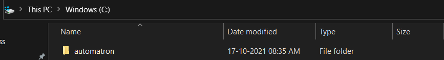
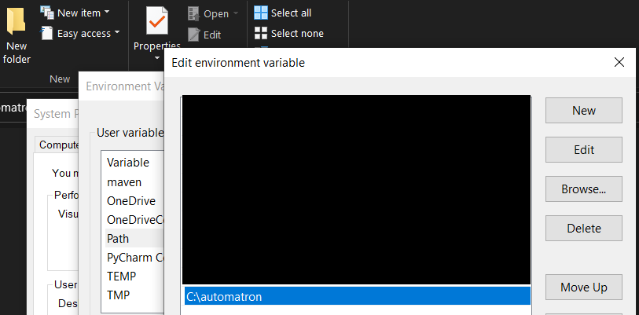

# automatron


On demand python batch script template generator.

### Introduction

Ever face issues at your job or any project that you are working on, where you need to generate thousands of lines of data, like population an excel sheet, populating an existing database, creating files used by other programs for testing. Stuff that requires hardwork. Yeah I've been there, because we are **Smart-Workers, Not Hard-Workers**. And so, we start working on a batch script, thinking of how to automate that data creation. And just like that, we start investing our precious time on this side problem of generating a batch script. We don't want that. Time is money. Why invest much time to that script generation when you can achieve the same using a couple of commands. You heard it right. **automatron** solves this problem. Wanna see how? Checkout the commands below.

### Generating projects

Generating projects through automatron is pretty straight forward.

1. Place the contents of ```dist/``` directory in your windows C drive.

    

2. Edit your system PATH variable and add the below mentioned entry.

    ```C:\automatron```

    

3. Open command prompt or windows power shell and execute the below command to create project.

    ```automatron -c <your_project_name>```

### Supported OS

As of now, only windows platform is supported by **automatron**.
Unix platform support to be added shortly.

### Tech Stack

* Python 3.9

### Future Enhancements

- [ ] Adding support of xml, json, csv and restapi
- [ ] Containerization with Docker
- [ ] Managing downloadable content through Nexus
